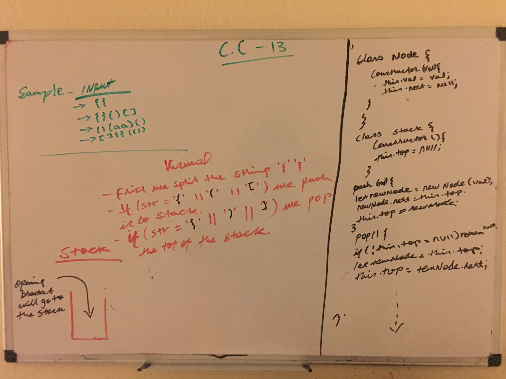

# Linked List Implementation
The function should take a string as its only argument, and should return a boolean representing whether or not the brackets in the string are balanced. There are 3 types of brackets:

* Round Brackets : ()

* Square Brackets : []

* Curly Brackets : {}

#### Node Class properties:

val - The val stored in the Node
next - A pointer the next Node in the list

#### Stack Class properties

`pop()`

  * that does not take any argument, removes the node from the top of the stack, and returns the node’s value.

`push()`

  * which takes any value as an argument and adds a new node with that value to the top of the stack with an O(1) Time performance.

#### Validator function
  * checks if the brackets are open or closed. If it is open it will push to the stack or if it is closed bracket it pop from the stack and check if it matches then return booloen.

    
## Links

* [PR link for lab-11](https://github.com/Eyob1984/data-structures-and-algorithms/pull/53) *

    
    
## Testing
  `npm test stack and queues` or `jest --verbose --coverage`

## UML

