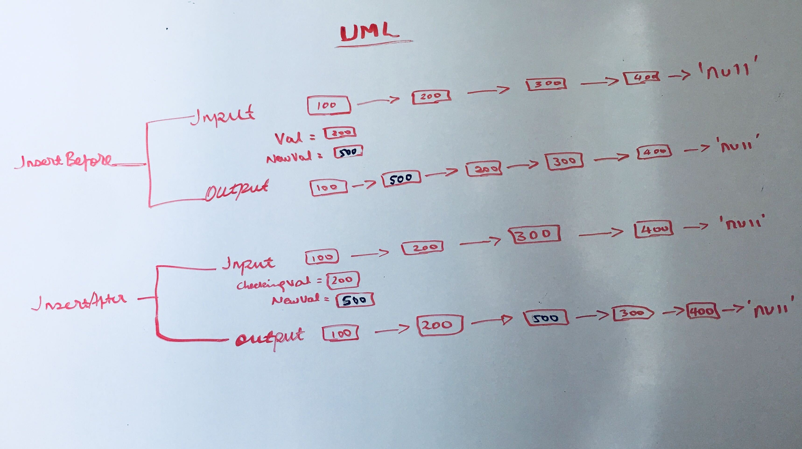
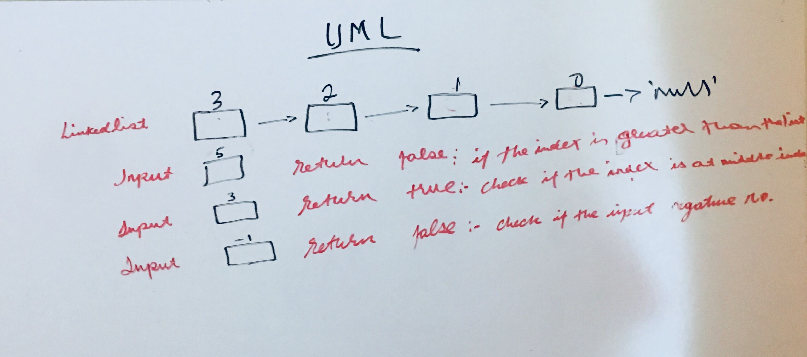

# Linked List Implementation
The challenge was to create two classes, Node and LinkedList. 

Node Class properties:

data - The data stored in the Node
next - A pointer the next Node in the list
prev - A pointer to the previous Node in the list (not doing anything this time.)

LinkedList Class properties

head - The Node that represents the beginning or start of the list
LinkedList Class have the following methods:

*insert()* -  takes and any value as anrgument and adds a new Node inthe beginning of the list before the current head.

*includes()* -  takes in a value as an argument and returns true or false if that value was found in the list

*toString()* - A function that takes no arguments but prints out a visual representation of the Linked List.

*insertBefore()* - A which add a new node with the given newValue immediately before the first value node

*insertAfter()* - which add a new node with the given newValue immediately after the first value node

*checkIndex()* - a method for the Linked List class which takes a number, k, as a parameter. Return the node’s value that is k from the end of the linked list.

    
## Links
*[PR link](https://github.com/Eyob1984/data-structures-and-algorithms/pull/39)*
*[PR link for Code challange -08](https://github.com/Eyob1984/data-structures-and-algorithms/pull/43)*
    

## Approach & Efficiency

    
    
## Testing
  `npm test linked-list.js` or `jest --verbose --coverage`

## UML

