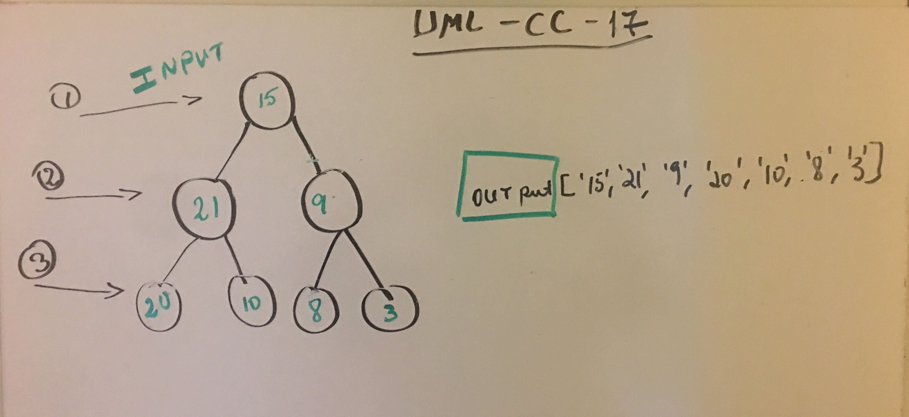

#### TreeNode Class properties:

val - The val stored in the Node
right - A pointer the indicate to right 
left - A pointer the indicate to left

#### QNode class properties

val - The val stored in the Node
Next - It indicates the next node

#### Queue Class properties

`enqueue()`

  * which takes any value as an argument and adds a new node with that value to the back of the queue with an O(1) Time performance.

`dequeue()`

  * that does not take any argument, removes the node from the front of the queue, and returns the node’s value.

#### BinaryTree Class properties

`breadthFirst()`

  * It traverse the input tree using a Breadth-first approach, and return a list of the values in the tree in the order they were encountered.

    
## Links

* [PR link](https://github.com/Eyob1984/data-structures-and-algorithms/pull/60) *

    
    
## Testing
  `npm test stack and queues` or `jest --verbose --coverage`

## UML

