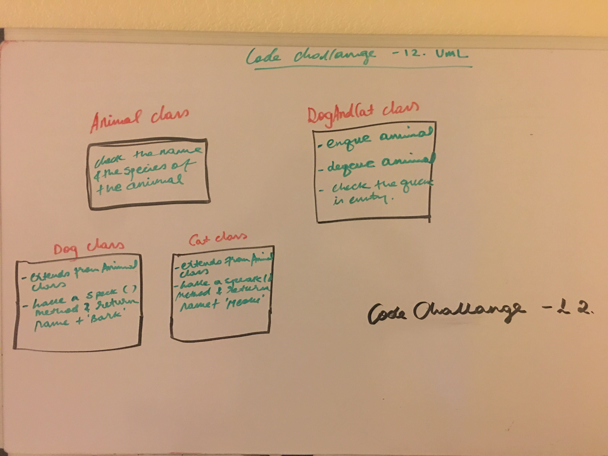

# Animal Shelter Queue Implementation
The challenge was to reate a class called AnimalShelter which holds only dogs and cats. The shelter operates using a first-in, first-out approach.

#### Node Class properties:

val - The val stored in the Node
next - A pointer the next Node in the list

#### Animal Class properties;

  * Checks the name and the species of the animals.

#### Dog Class properties;

* It is extended form the Animal class and have a method of `speak()` which returns the name and the sound of the dogs.

#### Cat Class porperties;

* It is extended form the Animal class and have a method of `speak()` which returns the name and the sound of the cats.

#### DogAndCatShelter  Class properties

`enqueue()`

  * which takes any value as an argument and adds a new node with that value to the back of the queue with an O(1) Time performance.

`dequeue()`

  * that does not take any argument, and travers thru the queue and checks the val is a dog or a cat. 

    
## Links

* [PR link for code-challanges-12](https://github.com/Eyob1984/data-structures-and-algorithms/pull/50) *

    
    
## Testing
  `npm test stack and queues` or `jest --verbose --coverage`

## UML
