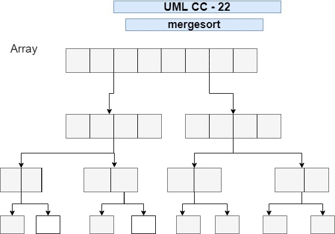

# mergesort

  a merge sort works as follows:

    * Divide the usorted list into n sublists, each containing one element(a list of one element is considered sorted).

    * REpeatedly mege sulists to product new sorted sublists until there is only one sublist remaning. This will be the sorted list. *
    
 

#### mergeSort function

   * First checks if the value in the array is < 2.

  * Then, if the values in the array > 2, the function divides the array into two and assigns it to variables by using the recursive method.

  * Finally, it returns it to the next function by passing to two variables as a parameter. 

#### merge fucnction

* This function takes two arguments and while the two arguments greater than 0 it pushes it into a new array.
    
## Links

* [PR link CC 22](https://github.com/Eyob1984/data-structures-and-algorithms/blob/merge-sort/data-structures/merge-sort/README.md) *

    
    
## Testing
  `npm test stack and queues` or `jest --verbose --coverage`

## UML

[reference](https://en.wikipedia.org/wiki/Merge_sort)
