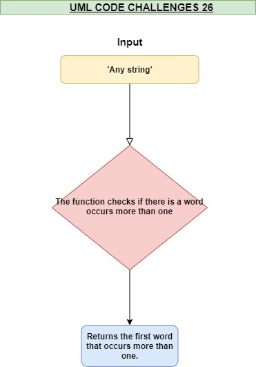

## Class 26 Code Challenge 

#### repeated-word function :

  * Is a  function that accepts a lengthy string parameter and  return the first word to occur more than once in that provided string.

  
   
## Links

* [PR link](https://github.com/Eyob1984/data-structures-and-algorithms/blob/repeated-word/data-structures/repeated-word/README.md) 

 
## Testing
  `npm test stack and queues` or `jest --verbose --coverage`

## UML

