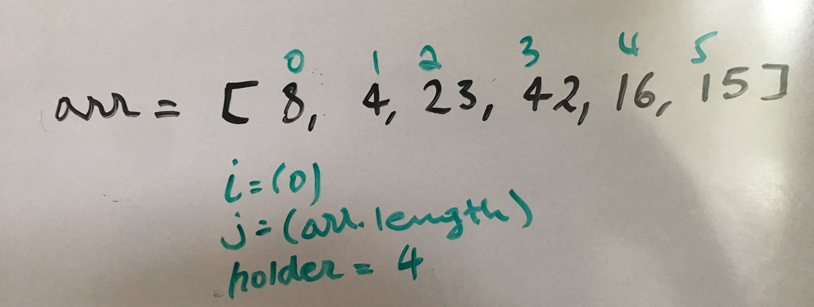

## Selection Sort

  The selection sort algorithm sorts an array by repeatedly finding the minimum element from unsorted array. 

### Algorithm

  <const sort = (arr) => {
    let holder;
    for(let i = 0; i<arr.length; i++){
      for(let j = 0; j<arr.length; j++){
         if(arr[j] > arr[i]){
            holder = arr[j];
            arr[j] = arr[i];
              arr[i]= holder;
      }
    }
  }
  
  return arr;
}>

#### Trace

Sample Array: `[8, 4 23, 42, 16, 15]`

The first step is checking by taking the first index from the array which is arr[i] means arr[0] and compaing with all the indexes in the array by grabbing them using arr[j]. In a nested loop when the outer for loop itreates ones the inner for loop itreates the whole length.

