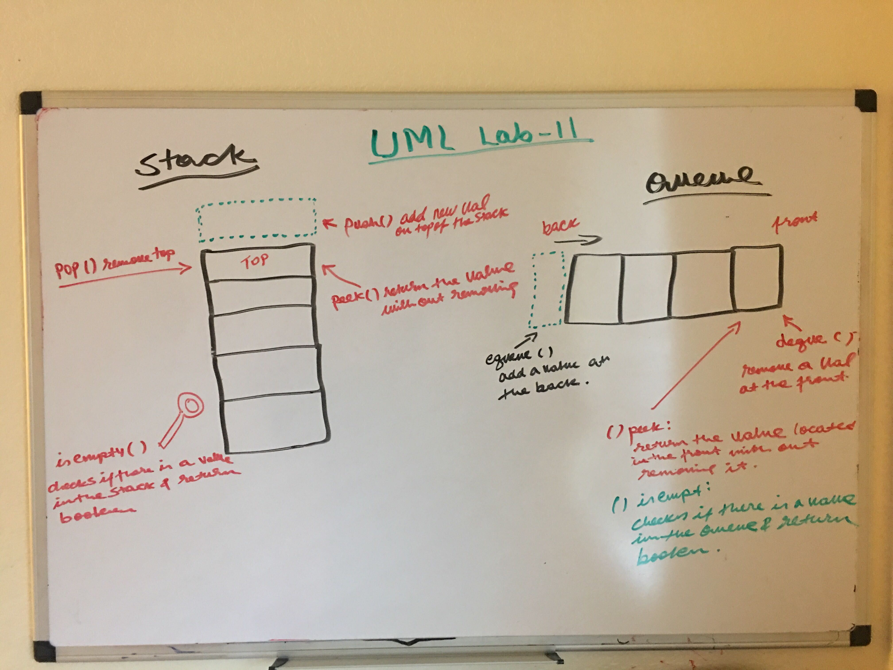

# Linked List Implementation
The challenge was to create three classes, Node, Stack and Queue. 

#### Node Class properties:

val - The val stored in the Node
next - A pointer the next Node in the list

#### Stack Class properties

`pop()`

  * that does not take any argument, removes the node from the top of the stack, and returns the node’s value.

`push()`

  * which takes any value as an argument and adds a new node with that value to the top of the stack with an O(1) Time performance.

`peek()`

  * that does not take an argument and returns the value of the node located on top of the stack, without removing it from the stack.

`isempty()`

  * that takes no argument, and returns a boolean indicating whether or not the stack is empty.

#### Queue Class properties

`enqueue()`

  * which takes any value as an argument and adds a new node with that value to the back of the queue with an O(1) Time performance.

`dequeue()`

  * that does not take any argument, removes the node from the front of the queue, and returns the node’s value.

`peek()`

  * that does not take an argument and returns the value of the node located in the front of the queue, without removing it from the queue.

`isempty()`

   * that takes no argument, and returns a boolean indicating whether or not the stack is empty.

Queue Class properties

    
## Links

* [PR link for lab-11](https://github.com/Eyob1984/data-structures-and-algorithms/tree/master/data-structures/stacksAndQueues) *

    
    
## Testing
  `npm test stack and queues` or `jest --verbose --coverage`

## UML
