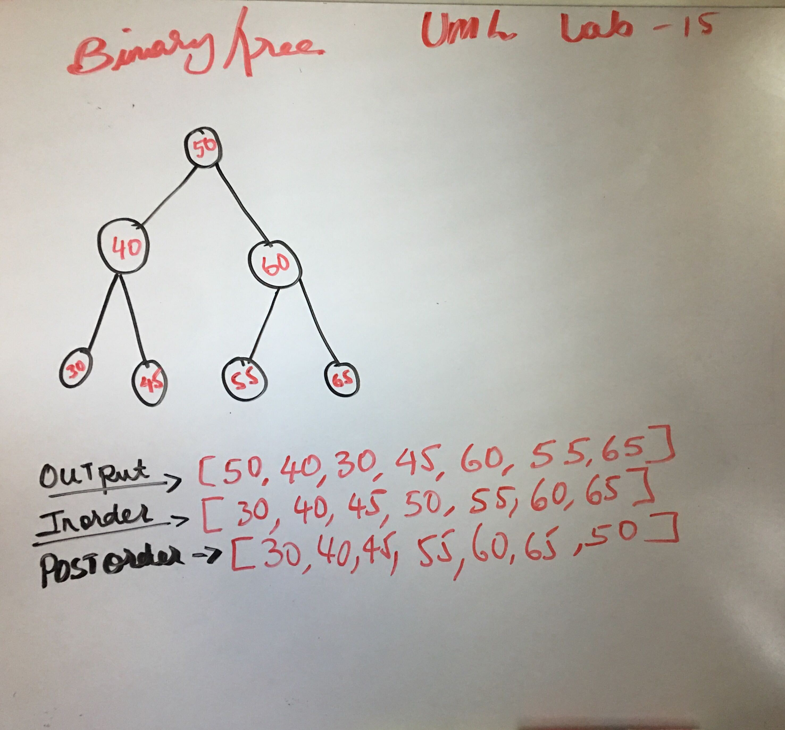
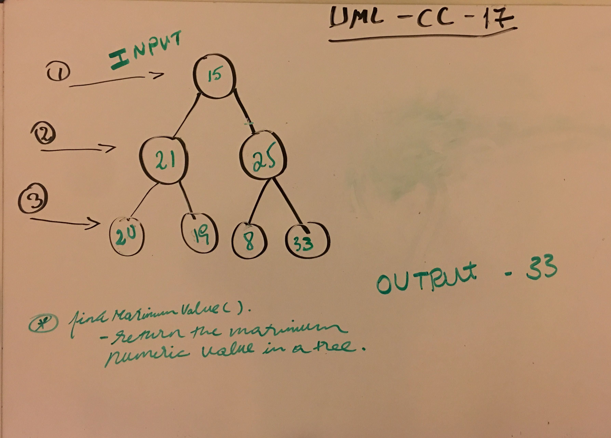

# Binary Search TreeImplementation
The challenge was to create three classes, Node, Stack and Queue. 

#### Node Class properties:

val - The val stored in the Node
right - A pointer the indicate to right 
left - A pointer the indicate to left

#### BinaryTree Class properties

`preOrder()`

  * A function that traverses the tree using preOrder depth-first traversal, and returns an array containing all the values in the traversed order.

`inOrder()`

  *A function that traverses the tree using inOrder depth-first traversal, and returns an array containing all the values in the traversed order.

`postOrder()`

  *  A function that traverses the tree using postOrder depth-first traversal, and returns an array containing all the values in the traversed order

`findMaximumValue()` - a method that can return the maximum numeric value stored in the tree.

#### Binary Search Tree Class properties

`add()`

  *A function that takes in a value as a parameter, and then adds a new Node with that value in the correct locations of the binary search tree

`insertNode()`

  * A function that takes in a value as a parameter and then checks the value. If the value is greater it push it to left of the tree and if the value is lessthan it push it to right side of the tree.

`contains()`

  * A function that takes in a value as a parameter, and returns true if that value is in the tree, and false if not

    
## Links

* [PR link for lab-11](https://github.com/Eyob1984/data-structures-and-algorithms/pull/56) *
* [PR link for Code challange -18](https://github.com/Eyob1984/data-structures-and-algorithms/pull/61)
    
    
## Testing
  `npm test stack and queues` or `jest --verbose --coverage`

## UML

